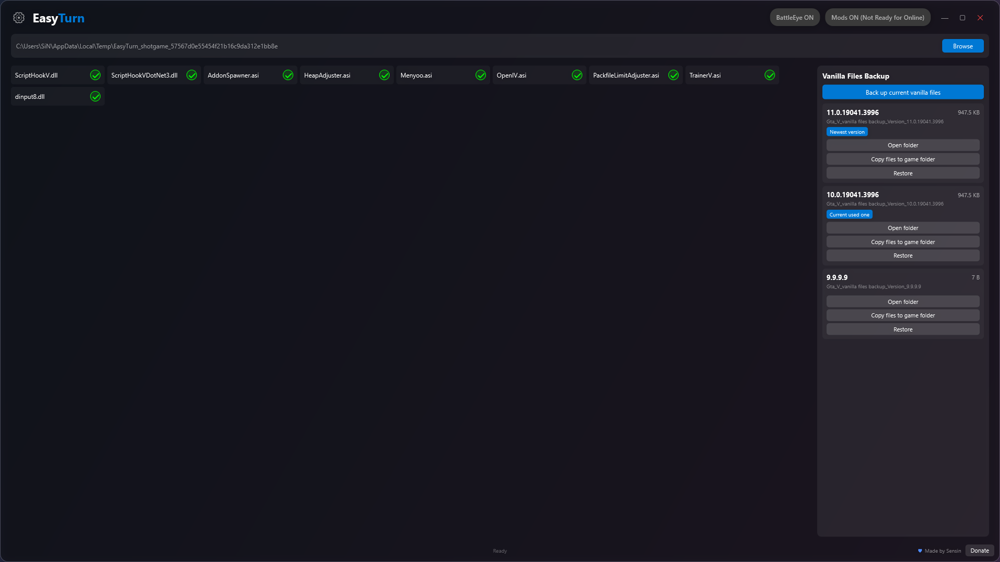
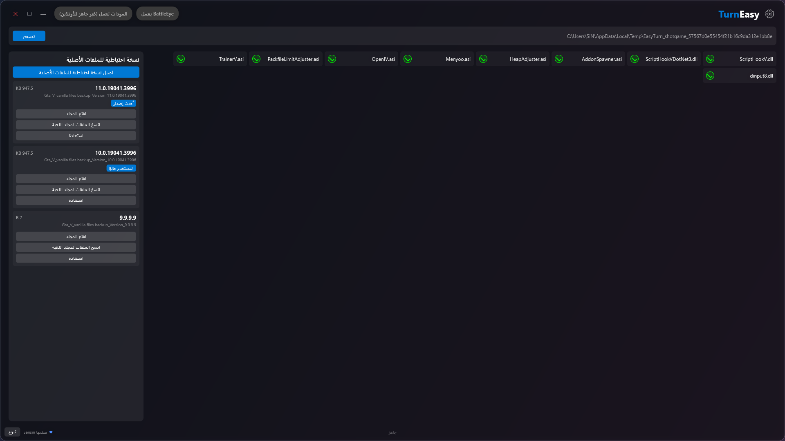
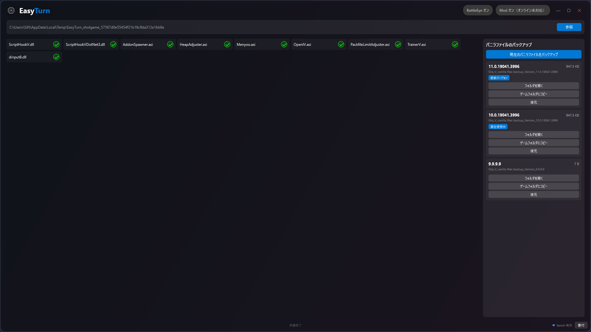
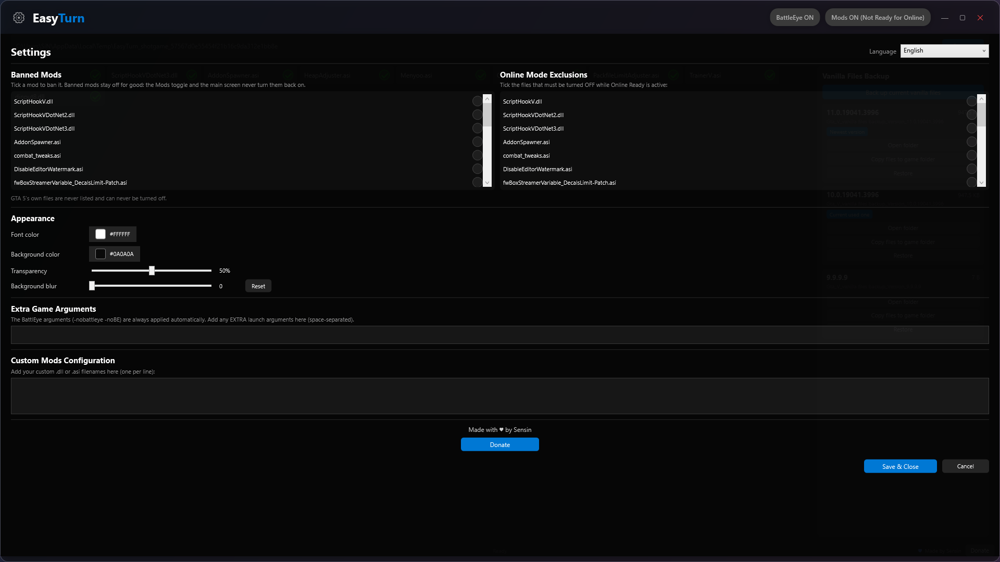

# EasyTurn

**v1.0.0** · made by [Sensin](https://bio.site/Sensin.mod) · GPL-3.0

A simple, safe mod manager for GTA 5 single player. Turn all your mods on or off with one click,
flip everything off before you go online, ban mods so they can never come back, and back up the
game's original files so you can always return to vanilla. Nothing is ever deleted. 13 languages.

It's built for people who mod single-player GTA V but still want to go online safely: mods are
renamed on and off (`.dll` → `.xdll`) rather than removed, BattlEye is flipped off for you, and
the game's genuine files can be backed up at any time.

---

## Features

| | |
|---|---|
| **Two toggles, one click** | `Mods ON (Not Ready for Online)` and `Mods OFF (Ready for Online)`, plus a `BattleEye ON/OFF` switch. |
| **Nothing is deleted** | Mods are renamed between `.dll`/`.asi` and `.xdll`/`.xasi`. Restoring is always possible. |
| **Banned mods** | Ban a mod in the settings and it stays off for good — the Mods toggle will never bring it back. |
| **Online mode exclusions** | Pick the files that must be off while Online Ready is active (e.g. `xinput1_4.dll`). |
| **Vanilla file backup** | Copy the game's real files into a version-stamped folder, then put them back any time. |
| **Game files are protected** | GTA V's own files are never listed, can never be toggled off, and are restored automatically if one was renamed. |
| **Appearance** | Font colour and background colour (full colour picker), window transparency and background blur. |
| **13 languages** | English, العربية, Türkçe, Español, Русский, 中文, 日本語, Deutsch, Português, Bahasa Indonesia, हिन्दी, اردو, বাংলা. |

---

## Requirements

- Windows 10 or 11 (64-bit)
- GTA V (Steam, Epic or Rockstar) — single-player modding only

### ⚠️ You must install .NET 8 first

EasyTurn needs **.NET 8** and will not start without it. Download it from:

**<https://dotnet.microsoft.com/download/dotnet/8.0>**

- **Just running the app?** Get the **.NET Desktop Runtime 8 (x64)** — the smaller download.
- **Building from source?** Get the **.NET 8 SDK** instead (it includes the runtime).

If you launch EasyTurn and nothing happens, or Windows shows a missing-framework error, this is
the reason — install .NET 8 and try again.

---

## Getting started

1. Download the latest build, or build it yourself (see below).
2. Run `EasyTurn.exe`.
3. Press **Browse** and pick the folder that contains `GTA5.exe`.
4. Toggle your mods, or hit **Back up current vanilla files** once so you have a clean copy.

### Build from source

```bash
git clone https://github.com/Abdulrhman-0/Easyturn_Gta5.git
cd Easyturn_Gta5
dotnet build EasyTurn.csproj -c Release
```

The app appears in `bin/Release/net8.0-windows/win-x64/`. A GitHub Actions workflow builds
it on every push too.

---

## How it works

### The two toggles

- **`Mods ON (Not Ready for Online)`** — your mods are active. `ScriptHookV.dll`, `dinput8.dll`
  and everything you listed as an online exclusion are switched back on.
- **`Mods OFF (Ready for Online)`** — the ASI loaders and your online exclusions are renamed
  out of the way so the game boots clean.
- **`BattleEye ON/OFF`** — writes (or removes) `args.txt` containing `-nobattleye -noBE`.

Exactly what the toggle will do is shown on the button, so you never have to guess the state.

### Banned mods

Anything you tick under **Banned Mods** in the settings is switched off on disk immediately and
hidden from the main screen. The Mods toggle ignores banned mods completely, so a mod you never
want active can't come back by accident. Untick it to bring it back.

### Online mode exclusions

A tick list of the files that should be disabled while Online Ready is active. It's a list
instead of a text box, so nothing has to be typed and nothing can be misspelled.

### Vanilla files backup

**Back up current vanilla files** copies the game's genuine files into

```
VanillaBackups/Gta_V_vanilla files backup_Version_<game version>/
```

- Only the files GTA V really ships are copied — `.exe`, `.dll`, `common.rpf`, `version.txt`,
  `title.rgl`, and the versioned Epic `EOSSDK` library. **Mod files are never included.** The
  exact list lives in `VanillaFiles.cs`.
- Operations are **copy-only**. Nothing in your game folder is ever moved or deleted.
- Clicking the button twice confirms before overwriting, and any leftover mod file that found
  its way into an older backup is moved into a `NotVanilla_Removed` subfolder — never deleted,
  and never copied back into the game.
- Every folder lists its **size**, has an **Open folder** button, and shows
  **Newest version** / **Current used one** badges in the app's blue.
- **Copy files to game folder** and **Restore** put the backed-up files back into the game
  folder. Both ask for confirmation twice.

The app refuses to touch files while GTA V is running.

### Game files are protected

GTA V's own files are a known, fixed set. They are never shown in the mod list, can never be
turned off, and if one was ever renamed to a disabled name it is renamed back the moment the
app starts — a game `.dll` can't stay broken.

### Appearance

In the settings panel:

- **Font color** — the colour of the app's text. Opens a Photoshop-style picker (hue strip,
  saturation/value square, alpha bar, hex and R/G/B/A boxes).
- **Background color** — same picker, for the window background.
- **Transparency** — `0%` is fully see-through, `100%` is solid. Default is `50%`.
- **Background blur** — frosted-glass behind the window.
- **Reset** — back to the defaults.

Everything is stored in `%APPDATA%\EasyTurn\settings.json`.

> **If you set transparency to 0%** the window becomes invisible. Open the settings panel
> first (the panel stays readable), or delete `%APPDATA%\EasyTurn\settings.json` to reset.

---

## Languages

Pick a language at the top of the settings panel. Arabic and Urdu also flip the whole layout
right-to-left.

Every string the app ships is mirrored as plain text in [`Languages/`](Languages), one file per
language, named with the full language name (`arabic.txt`, `japanese.txt`, …) rather than a short
code:

```
# EasyTurn english (English)
# Language code: en
# One entry per line in the form  key=value
# Keys: 74

alpha=Alpha
appearance=Appearance
backgroundColor=Background color
...
```

Found a bad translation, or want to add a language? Edit or add a file and open a pull request.

---

## Support

EasyTurn is made by **Sensin** and given away for free.

If it saved you some trouble, you can buy me a coffee:

### [♥ Donate](https://bio.site/Sensin.mod)

---

## License

EasyTurn is released under the [GNU General Public License v3.0](LICENSE).

---

## Disclaimer

EasyTurn is an unofficial fan tool. It is not affiliated with or endorsed by Rockstar Games or
Take-Two Interactive. Using mods in GTA Online breaks Rockstar's terms of service and can get
your account suspended — always use **Mods OFF (Ready for Online)** before going online. Use at
your own risk.

The game's own files are **not** included in this repository; the reference folder used to build
the vanilla file list is deliberately excluded, along with third-party tool readmes.

---

## Screenshots

**English**



**العربية (right-to-left)**



**日本語**



**Settings panel**


