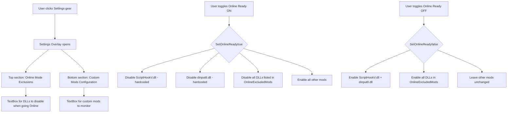

# Plan: Add "Online Mode Exclusions" Section to EasyTurn

## Problem
The user encountered `xinput1_4.dll` causing GTA V to fail launching (conflict with BattlEye anti-cheat when going online). Currently, the app has one "Custom Mods Configuration" box, but no way to specify DLLs that should be **disabled** when switching to "Online Ready" mode (in addition to the hardcoded `ScriptHookV.dll` and `dinput8.dll`).

## Solution
Add a new **"Online Mode Exclusions"** section **at the top** of the Settings overlay, where users can specify DLLs that should be automatically disabled when toggling "Online Ready" mode.

## Architecture Overview



## Files to Modify

### 1. [`AppSettings.cs`](../AppSettings.cs:9) - Add new property
- Add `public List<string> OnlineExcludedMods { get; set; } = new();`
- JSON serialization handles it automatically via `Load()`/`Save()`

### 2. [`MainWindow.xaml`](../MainWindow.xaml:203) - Add new UI section
- In the Settings Overlay (lines 203-224), add a **new top section** before the existing one:
  - Title: "Online Mode Exclusions"
  - Description: "Add .dll or .asi filenames that should be disabled when Online Ready is active (e.g., xinput1_4.dll)"
  - New TextBox: `x:Name="TxtOnlineExcludedMods"`
- Shift the existing "Custom Mods Configuration" section below it
- Adjust layout (Grid.RowDefinitions) to accommodate both sections

### 3. [`MainWindow.xaml.cs`](../MainWindow.xaml.cs:75) - Update Settings handlers
- In `Settings_Click`: Also populate `TxtOnlineExcludedMods.Text` with `_settings.OnlineExcludedMods`
- In `SaveSettings_Click`: Also parse and save `TxtOnlineExcludedMods` to `_settings.OnlineExcludedMods`

### 4. [`ModManager.cs`](../ModManager.cs:43) - Update LoadMods and SetOnlineReady
- In `LoadMods()`: Also include `_settings.OnlineExcludedMods` in the `allMonitored` list so those files appear in the mod grid
- In `SetOnlineReady()`:
  - When `isOnline = true`: Also disable any mod whose name is in `OnlineExcludedMods`
  - When `isOnline = false`: Also re-enable any mod whose name is in `OnlineExcludedMods`

### 5. [`mods.ini`](../mods.ini) (optional)
- Update comments to mention the new Online Exclusions feature

## Detailed Behavior

### When Online Ready is toggled ON:
| Mod Category | Action |
|---|---|
| `ScriptHookV.dll` | **Disabled** (hardcoded in code) |
| `dinput8.dll` | **Disabled** (hardcoded in code) |
| Files in `OnlineExcludedMods` (e.g., `xinput1_4.dll`) | **Disabled** |
| All other monitored mods | **Enabled** |

### When Online Ready is toggled OFF:
| Mod Category | Action |
|---|---|
| `ScriptHookV.dll` | **Enabled** (restored) |
| `dinput8.dll` | **Enabled** (restored) |
| Files in `OnlineExcludedMods` | **Enabled** (restored) |
| All other monitored mods | Left unchanged (remain in current state) |

## UX Mockup of Settings Overlay

```
┌─────────────────────────────────────┐
│  Online Mode Exclusions             │ ← New title
│  Add .dll/.asi to disable when      │
│  Online Ready is active:            │
│  ┌─────────────────────────────┐    │
│  │ xinput1_4.dll               │    │ ← New TextBox
│  │ ...                         │    │
│  └─────────────────────────────┘    │
│                                     │
│  Custom Mods Configuration          │ ← Existing title (shifted down)
│  Add your custom .dll/.asi here:    │
│  ┌─────────────────────────────┐    │
│  │ MyMod.asi                   │    │ ← Existing TextBox
│  │ ...                         │    │
│  └─────────────────────────────┘    │
│                                     │
│              [Save & Close] [Cancel]│
└─────────────────────────────────────┘
```

## Edge Cases & Considerations

1. **Duplicate entries**: If a DLL is in both `CustomMods` and `OnlineExcludedMods`, it will be monitored once (via `Distinct()`) and disabled when Online Ready is active.
2. **Empty list**: If `OnlineExcludedMods` is empty, behavior is identical to current app (no change).
3. **Case-insensitive**: All comparisons should remain case-insensitive (already done in codebase).
4. **Persist across sessions**: `OnlineExcludedMods` is saved to `settings.json` alongside `CustomMods`.
5. **Manual checkbox override**: Users can still manually toggle these mods via the checkboxes in the mod grid; the Online Ready logic just sets them automatically when toggling.
